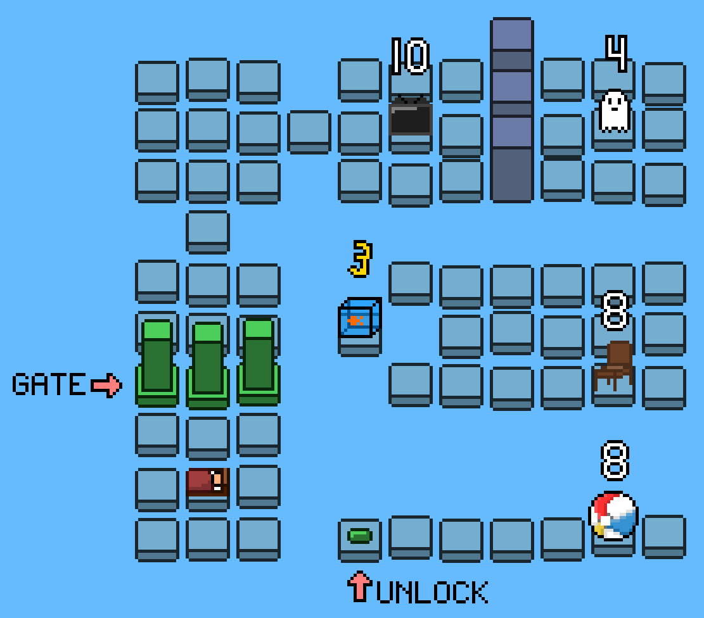

# Astral Instability - Ludum Dare 49

Theme: Unstable 

Uh oh! You were astral projecting and the connection to your body was severed! Astral bodies cannot survive for long without a real body, so you will have to possess various objects to get back to your physical self. But be careful, your lifeforce is incompatible with these objects so you cannot stay in a single object for too long!

You can use the arrow keys to move and spacebar to perform actions. 

## How to Play 

### Windows 

Download `AstralInstability_Windows.zip` from the releases, extract the zip file and run `AstralInstability.exe`. 

### Windows, Linux, and Mac 

Download `AstralInstability_CrossPlatform.zip` from the releases and extract the zip file. In a terminal, navigate to the extracted directory and type `java -jar AstralInstability.jar` to play. Note that you must have Java 7+ installed. Alternatively, you can double click the jar file on Windows (and on Linux after marking the file as executable). 

Mac support has not been tested. 

### Build from Source 

Download the code and run the bash script `build.sh` (should also work with Git Bash on windows) to generate `AstralInstability.jar`. 
